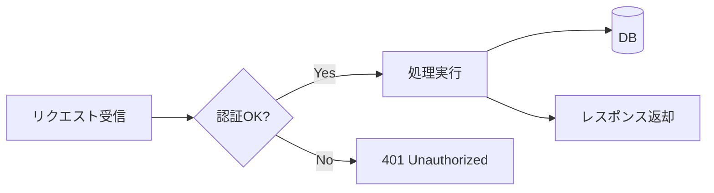
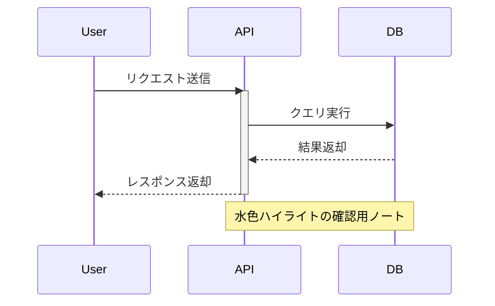
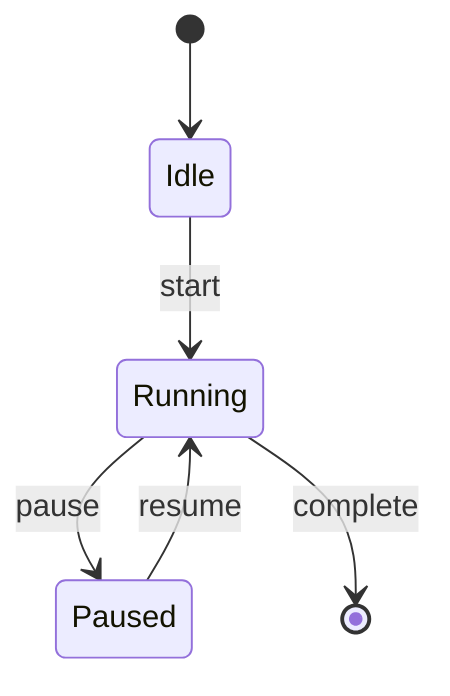

このページはmermaidダイアグラムのダーク基調配色(ダークネイビー背景+水色アクセント)を確認するための検証用記事。

## flowchartの例

```mermaid
flowchart LR
  A[リクエスト受信] --> B{認証OK?}
  B -- Yes --> C[処理実行]
  B -- No --> D[401 Unauthorized]
  C --> E[(DB)]
  C --> F[レスポンス返却]
```

## sequence diagramの例

```mermaid
sequenceDiagram
  participant User
  participant API
  participant DB

  User->>API: リクエスト送信
  activate API
  API->>DB: クエリ実行
  DB-->>API: 結果返却
  API-->>User: レスポンス返却
  deactivate API

  Note over API,DB: 水色ハイライトの確認用ノート
```

## state diagramの例

```mermaid
stateDiagram-v2
  [*] --> Idle
  Idle --> Running: start
  Running --> Paused: pause
  Paused --> Running: resume
  Running --> [*]: complete
```
